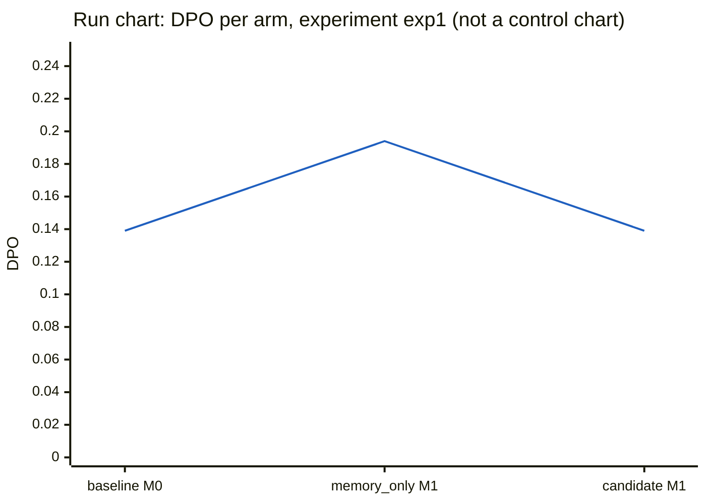

# Experiment exp1: DMAIC report

Generated by `python -m adaptive_harness report` from the MongoDB records of this experiment (runs, events, evaluations, harness_versions, lessons, experiments). Nothing here is written by hand.

- Decision: **rejected** (candidate v2)
- Where the cycle stopped: improve (tollgate did not pass: acceptance rules do not all hold; the current version stays pinned; R2 improvement: development checks passed: candidate worst 11, current best 11)
- Cases: D1 (development), D2 (development), H1 (held_out), H2 (held_out), P1 (control), P2 (control)
- Arms, in the order they ran: baseline (v1 on M0), memory_only (v1 on M1), candidate (v2 on M1)
- Version v1: status baseline, pinned True, config hash `e2f2dfa286b03eb3b3334d6bfb226f9503a5f8534693430191d982c4a8144538`
- Version v2: status rejected, pinned False, config hash `e4b4130ae396e591b9b259261ae228324ff10cc01a23cb759ea01a612791fa22`

Run ids by arm:

| arm | case | run id | status |
|---|---|---|---|
| baseline | D1 | D1-20260926T154911-6b7637 | hold |
| baseline | D2 | D2-20260926T155855-9c8fbc | completed |
| baseline | H1 | H1-20260926T154911-2bba7c | completed |
| baseline | H2 | H2-20260926T155855-9efaf2 | completed |
| baseline | P1 | P1-20260926T154911-402f2e | completed |
| baseline | P2 | P2-20260926T155855-b7a76a | completed |
| memory_only | D1 | D1-20260926T161150-1506db | hold |
| memory_only | D2 | D2-20260926T161150-834107 | completed |
| memory_only | H1 | H1-20260926T161150-5395e1 | completed |
| memory_only | H2 | H2-20260926T161437-bdfe67 | completed |
| memory_only | P1 | P1-20260926T161523-87d9cf | completed |
| memory_only | P2 | P2-20260926T161623-2cc5ca | completed |
| candidate | D1 | D1-20260926T161932-6be8ce | hold |
| candidate | D2 | D2-20260926T161932-00d022 | completed |
| candidate | H1 | H1-20260926T161932-8ddb33 | completed |
| candidate | H2 | H2-20260926T162246-626145 | completed |
| candidate | P1 | P1-20260926T162316-c1e4d1 | completed |
| candidate | P2 | P2-20260926T162325-65f4d9 | completed |

## Define

**Tollgate: PASSED** (passed). 1 development defect(s) in the baseline arm.

### Case set

Operator decision: exp1's baseline covers six cases, the three default cases (D1, H1, P1) and the three optional race-audit cases (D2, H2, P2). All six were published in data/cases.json before any harness code. The optional cases were included because the only default development case, D1, has zero races at its venue and so cannot exhibit citation defects. The optional cases were fixed in advance and were used, not added. Every pilot arm covers the same six cases.

### Charter

- Evidence: development cases only (D1, D2).
- Baseline (baseline arm, 2 runs): 0.083 (1/12) defects per opportunity; failure categories {"evidence_missing": 1}.

Critical-to-quality characteristics with defects:

| check | name | statement | failure category | DPO (defects/opps) |
|---|---|---|---|---|
| E7 | evidence | Every race row cites recorded tool results from the same run about that race. | evidence_missing | 0.500 (1/2) |

Scope (the editable surfaces):

| cause | surface | description |
|---|---|---|
| method | `/stages` | Stage order and optional stages. |
| material | `/context_policy` | The information each role receives. |
| measurement | `/checks` | In-harness checks. |

Out of scope: model, tools, charters, data, evaluator, specification.

Goal (the acceptance rules):

- No run ends HARNESS after one rerun, judged from run metadata.
- Every check that passes on a control case under the current configuration also passes under the candidate.
- The candidate passes strictly more development-case checks; with repeated runs, its worst run must beat the current configuration's best.
- The candidate passes at least as many held-out checks.
- The candidate's total wall-clock time is at most 1.5 times the current configuration's.

### Problem statement

> On the development cases, the baseline arm had 1 defect across 2 runs and 12 opportunities, a DPO of 0.0833, and all of it falls in the evidence_missing category. The only failing check is E7 (evidence: every race row cites recorded tool results from the same run about that race), which failed in 1 of its 2 opportunities, a DPO of 0.5. No other check recorded a defect.

## Measure

**Tollgate: PASSED** (passed). measurement valid: 6 baseline run(s) re-scored identically, hashes confirmed, no HARNESS result remains.

### Measurement checks

- Evaluator SHA-256: `44d57885373b57f710a7ef757d47398b3163fd71b4d1926ab4d70ce420044787`
- Answer-key SHA-256: `b010ed344f150fe9f107745a416d91673df9242d72a126aa22f10fc903d8034d` (matches `data/key.sha256`)
- HARNESS reruns: 0

Re-score of every baseline run in a fresh evaluator process:

| run id | identical verdicts | evaluator hash match | key hash match | differing checks |
|---|---|---|---|---|
| D1-20260926T154911-6b7637 | True | True | True | none |
| P1-20260926T154911-402f2e | True | True | True | none |
| H1-20260926T154911-2bba7c | True | True | True | none |
| D2-20260926T155855-9c8fbc | True | True | True | none |
| H2-20260926T155855-9efaf2 | True | True | True | none |
| P2-20260926T155855-b7a76a | True | True | True | none |

### Defects per opportunity by arm

Each cell is DPO with (defects/opportunities). HARNESS and NA are neither.

| arm | runs | DPO |
|---|---|---|
| baseline (v1 on M0) | 6 | 0.139 (5/36) |
| memory_only (v1 on M1) | 6 | 0.194 (7/36) |
| candidate (v2 on M1) | 6 | 0.139 (5/36) |

### By check

| check | name | baseline | memory_only | candidate |
|---|---|---|---|---|
| E1 | schema | 0.000 (0/6) | 0.000 (0/6) | 0.000 (0/6) |
| E2 | venue | 0.000 (0/3) | 0.333 (1/3) | 0.000 (0/3) |
| E3 | coverage | 0.000 (0/3) | 0.333 (1/3) | 0.000 (0/3) |
| E4 | indicators | 0.000 (0/6) | 0.000 (0/6) | 0.000 (0/6) |
| E5 | arithmetic | 0.000 (0/3) | 0.000 (0/3) | 0.000 (0/3) |
| E6 | disposition | 0.000 (0/3) | 0.000 (0/3) | 0.000 (0/3) |
| E7 | evidence | 0.833 (5/6) | 0.833 (5/6) | 0.833 (5/6) |
| E8 | budget | 0.000 (0/6) | 0.000 (0/6) | 0.000 (0/6) |

### By case set

| case set | baseline | memory_only | candidate |
|---|---|---|---|
| development | 0.083 (1/12) | 0.083 (1/12) | 0.083 (1/12) |
| held_out | 0.167 (2/12) | 0.167 (2/12) | 0.167 (2/12) |
| control | 0.167 (2/12) | 0.333 (4/12) | 0.167 (2/12) |

### Pareto table of defects by check

baseline (v1 on M0):

| check | name | defects | share | cumulative share |
|---|---|---|---|---|
| E7 | evidence | 5 | 1.00 | 1.00 |

memory_only (v1 on M1):

| check | name | defects | share | cumulative share |
|---|---|---|---|---|
| E7 | evidence | 5 | 0.71 | 0.71 |
| E2 | venue | 1 | 0.14 | 0.86 |
| E3 | coverage | 1 | 0.14 | 1.00 |

candidate (v2 on M1):

| check | name | defects | share | cumulative share |
|---|---|---|---|---|
| E7 | evidence | 5 | 1.00 | 1.00 |

### Cost per baseline run

Token counts come from the provider's usage reports. `input` includes prompt-cache writes (the runner's model client counts cache writes as input, see `adaptive_harness/runner/models.py`); `cache read` is input served from the prompt cache and is not included in `input`.

| run id | case | model calls | tool calls | input | output | cache read | wall s |
|---|---|---|---|---|---|---|---|
| D1-20260926T154911-6b7637 | D1 | 19 | 9 | 57,965 | 21,815 | 133,318 | 218.0 |
| P1-20260926T154911-402f2e | P1 | 28 | 17 | 62,523 | 20,549 | 312,985 | 206.8 |
| H1-20260926T154911-2bba7c | H1 | 15 | 5 | 52,794 | 15,588 | 63,245 | 151.5 |
| D2-20260926T155855-9c8fbc | D2 | 16 | 6 | 46,209 | 21,230 | 54,280 | 205.6 |
| H2-20260926T155855-9efaf2 | H2 | 13 | 4 | 49,949 | 15,857 | 32,932 | 151.6 |
| P2-20260926T155855-b7a76a | P2 | 15 | 6 | 43,762 | 14,988 | 35,667 | 144.4 |
| mean | | 17.7 | 7.8 | 52,200 | 18,338 | 105,404 | 179.7 |

No sigma level or capability index is reported (see Limits).

## Analyze

**Tollgate: PASSED** (passed). 1 verified controllable root cause(s) of 1 defect(s).

Development defects analyzed: 1; verified: 1; verified and controllable: 1; provisional (never retrieved): 0. Lessons written to snapshot M1.

### Root cause `lesson:exp1:D2-20260926T155855-9c8fbc:E7`

- Defect: E7 (evidence_missing) on case D2, run `D2-20260926T155855-9c8fbc`
- Cause category: **measurement** (controllable: True); status verified

Why-chain:

1. E7 failed with evidence_missing because the final race-audit brief (00037) did not tie its race row to recorded tool results about that race in the form the evaluator requires. The brief gives only one flat evidence list, which mixes the race data results (00014, 00017, 00022) with interval computations that are not about the race (00027, 00030, 00033).
2. The brief went out with this citation gap because the only in-harness check at S7 (00038) was a schema check. It passed with no reasons.
3. The schema check does not test whether each race row cites same-run tool_result events about that race. The run therefore reached a GO disposition (00039) with no chance to repair or HOLD the row.

Origin event `D2-20260926T155855-9c8fbc:00038` (S7 code check):

```
{"check": "schema", "passed": true, "reasons": []}
```

Source events: `D2-20260926T155855-9c8fbc:00037`, `D2-20260926T155855-9c8fbc:00038`, `D2-20260926T155855-9c8fbc:00039`, `D2-20260926T155855-9c8fbc:00017`, `D2-20260926T155855-9c8fbc:00022`, `D2-20260926T155855-9c8fbc:00027`

Lesson: Before any GO, an in-harness check should confirm that every race row in the brief cites at least one recorded tool_result from the same run whose arguments match that race (year and round). Computed statistics such as interval results must not count as race evidence, and any row that fails should be sent back for repair or set to HOLD.

## Improve

**Tollgate: DID NOT PASS** (stopped). acceptance rules do not all hold; the current version stays pinned; R2 improvement: development checks passed: candidate worst 11, current best 11.

### Proposal

Candidate v2 from v1, lesson retrieval: vector.

| op | path | value | cites root cause | why |
|---|---|---|---|---|
| replace | `/checks/venue_match/enabled` | true | `lesson:exp1:D2-20260926T155855-9c8fbc:E7` | The root cause is a measurement gap. At S7 (00038) the only in-harness check was schema, which passed with no reasons, so the D2 brief (00037) reached GO (00039) without any test that its race row is tied to recorded tool results about that race. The editable checks do not include one that tests per-row evidence citations directly. venue_match is the one whose name points to matching the brief's race against the race the data came from (year and round, as the 00017 and 00022 arguments show: year 2025, round 13). Enabling it adds a second gate before GO, where today there is only schema. The evidence does not show what venue_match actually tests, so this is a trial, not a confirmed fix. |

- Rationale: The verified root cause (measurement, surface /checks) is that S7 validates only schema. A brief whose single flat evidence list mixes race data results (00014, 00017, 00022) with interval computations (00027, 00030, 00033) therefore passed and got GO with no chance to repair the row or set HOLD. The lesson calls for an in-harness check that ties each race row to same-run tool results whose arguments match that race. Among the editable checks, venue_match is the only one aimed at race identity, so it is the closest available lever. I leave source_agreement and min_races_for_rate unchanged. The D2 brief did carry an SC source-mismatch objection, but the E7 root cause is about citations, not source agreement, and extra HOLD triggers could cost other checks without addressing E7.
- Expected effect: E7 on D2 (evidence_missing, failed in 1 of its 2 development opportunities). E7 improves only if venue_match flags rows that are not tied to same-race tool results and that flag leads to repair. The evidence given does not show whether venue_match inspects evidence citations, whether a failure triggers repair or only HOLD, or whether a HOLD would satisfy E7. The effect on E7 is therefore uncertain. No change is expected on E1–E6 or E8, which recorded no defects.
- Risks: (1) venue_match may not test evidence citations at all. E7 would then stay failed, and the rule requiring strictly more development-case checks would reject the candidate. (2) If venue_match is strict or misfires, it could turn correct GO runs into HOLD and break checks that currently pass. The rule that every check passing on a control case under the current configuration must still pass would catch this, as would the held-out rule (at least as many held-out checks). (3) Extra validation or repair loops could add wall time or cause HARNESS endings. The 1.5x wall-clock rule and the no-HARNESS-after-one-rerun rule would catch these.

**Validator verdict:** valid (no problems).

### Checks by case and arm

One row per case and check; one column per arm. NA rows (check not applicable in every arm) are omitted.

| case | set | check | baseline (v1 on M0) | memory_only (v1 on M1) | candidate (v2 on M1) |
|---|---|---|---|---|---|
| D1 | development | E1 schema | PASS | PASS | PASS |
| D1 | development | E2 venue | PASS | PASS | PASS |
| D1 | development | E3 coverage | PASS | PASS | PASS |
| D1 | development | E4 indicators | PASS | PASS | PASS |
| D1 | development | E5 arithmetic | PASS | PASS | PASS |
| D1 | development | E6 disposition | PASS | PASS | PASS |
| D1 | development | E7 evidence | PASS | PASS | PASS |
| D1 | development | E8 budget | PASS | PASS | PASS |
| D2 | development | E1 schema | PASS | PASS | PASS |
| D2 | development | E4 indicators | PASS | PASS | PASS |
| D2 | development | E7 evidence | FAIL | FAIL | FAIL |
| D2 | development | E8 budget | PASS | PASS | PASS |
| H1 | held_out | E1 schema | PASS | PASS | PASS |
| H1 | held_out | E2 venue | PASS | PASS | PASS |
| H1 | held_out | E3 coverage | PASS | PASS | PASS |
| H1 | held_out | E4 indicators | PASS | PASS | PASS |
| H1 | held_out | E5 arithmetic | PASS | PASS | PASS |
| H1 | held_out | E6 disposition | PASS | PASS | PASS |
| H1 | held_out | E7 evidence | FAIL | FAIL | FAIL |
| H1 | held_out | E8 budget | PASS | PASS | PASS |
| H2 | held_out | E1 schema | PASS | PASS | PASS |
| H2 | held_out | E4 indicators | PASS | PASS | PASS |
| H2 | held_out | E7 evidence | FAIL | FAIL | FAIL |
| H2 | held_out | E8 budget | PASS | PASS | PASS |
| P1 | control | E1 schema | PASS | PASS | PASS |
| P1 | control | E2 venue ◆ | PASS | FAIL | PASS |
| P1 | control | E3 coverage ◆ | PASS | FAIL | PASS |
| P1 | control | E4 indicators | PASS | PASS | PASS |
| P1 | control | E5 arithmetic | PASS | PASS | PASS |
| P1 | control | E6 disposition | PASS | PASS | PASS |
| P1 | control | E7 evidence | FAIL | FAIL | FAIL |
| P1 | control | E8 budget | PASS | PASS | PASS |
| P2 | control | E1 schema | PASS | PASS | PASS |
| P2 | control | E4 indicators | PASS | PASS | PASS |
| P2 | control | E7 evidence | FAIL | FAIL | FAIL |
| P2 | control | E8 budget | PASS | PASS | PASS |

◆ marks a check whose verdict differs between arms.

Checks passed per case set:

| case set | baseline | memory_only | candidate |
|---|---|---|---|
| development | 11 | 11 | 11 |
| held_out | 10 | 10 | 10 |
| control | 10 | 8 | 10 |

### Acceptance rules

| rule | holds | detail |
|---|---|---|
| R0 | yes | every run valid after at most one rerun |
| R1 | yes | no regression on 2 control case(s) |
| R2 | **no** | development checks passed: candidate worst 11, current best 11 |
| R3 | yes | held-out checks passed: candidate 10, current 10 |
| R4 | yes | wall-clock seconds: candidate 1134.9, current 1183.6, limit 1.5x |

Decision: **rejected**.

### Cost per arm

Token counts come from the provider's usage reports. `input` includes prompt-cache writes (the runner's model client counts cache writes as input, see `adaptive_harness/runner/models.py`); `cache read` is input served from the prompt cache and is not included in `input`.

No per-token prices were supplied by the operator, so no dollar cost is reported; tokens are reported per model.

| arm | runs | model calls | tool calls | input | output | cache read | wall s |
|---|---|---|---|---|---|---|---|
| baseline (v1 on M0) | 6 | 106 | 47 | 313,202 | 110,027 | 632,427 | 1,077.9 |
| memory_only (v1 on M1) | 6 | 130 | 71 | 389,137 | 116,996 | 1,487,332 | 1,183.6 |
| candidate (v2 on M1) | 6 | 119 | 56 | 345,199 | 116,571 | 963,112 | 1,134.9 |

Split by the model that answered (from the model_call events):

| arm | model | model calls | input | output | cache read |
|---|---|---|---|---|---|
| baseline | claude-opus-5-5 | 18 | 111,193 | 25,901 | 9,364 |
| baseline | claude-sonnet-5 | 88 | 202,009 | 84,126 | 623,063 |
| memory_only | claude-opus-5-5 | 18 | 108,250 | 25,381 | 11,785 |
| memory_only | claude-sonnet-5 | 112 | 280,887 | 91,615 | 1,475,547 |
| candidate | claude-opus-5-5 | 18 | 100,545 | 25,661 | 17,658 |
| candidate | claude-sonnet-5 | 101 | 244,654 | 90,910 | 945,454 |

Improvement-agent calls (outside the arms):

| phase | model | input | output | cache read |
|---|---|---|---|---|
| define | claude-opus-5-5 | 940 | 206 | 0 |
| analyze | claude-opus-5-5 | 16,175 | 1,047 | 0 |
| improve | claude-opus-5-5 | 6,046 | 1,369 | 0 |

## Control

**Tollgate: not reached.** The cycle stopped before this phase.

- Pinned version: **v1**, config hash `e2f2dfa286b03eb3b3334d6bfb226f9503a5f8534693430191d982c4a8144538`.
- Thresholds: none set. The control phase was not reached, so no control plan was armed for a new version; the pinned version above is unchanged.
- Reaction plan (as specified, applies once a version is accepted and pinned): a later run that passes fewer checks than its case's threshold is a signal; rerun the case 1 time(s); if the signal repeats, pin the parent version and open a new cycle using development-case evidence only. Runs under a different model assignment or FastF1 version are flagged, not compared.
- Confirmation: not run.

### Run chart: DPO per arm

This is a **run chart**, in the order the arms ran, not a control chart: statistical control limits need about 20 runs.

| order | arm | started | defects | opportunities | DPO |
|---|---|---|---|---|---|
| 1 | baseline (v1 on M0) | 2026-09-26 15:49:11 | 5 | 36 | 0.139 |
| 2 | memory_only (v1 on M1) | 2026-09-26 16:11:50 | 7 | 36 | 0.194 |
| 3 | candidate (v2 on M1) | 2026-09-26 16:19:32 | 5 | 36 | 0.139 |



## Limits

- 6 cases (2 development, 2 held_out, 2 control), one run per case per arm (runs recorded per arm: baseline 6, memory_only 6, candidate 6).
- No statistical claim is made: differences between arms are counts from single runs, and the model is not deterministic, so a repeat could differ.
- No sigma level and no capability index are reported; they need far more opportunities than this experiment has.
- The run chart is not a control chart; statistical control limits need about 20 runs.
- Evidence rule (configs/cycle.json): only development cases may inform define, analyze, and the improvement agent's prompts; held-out and control results are used only by code, to verify and control. The define charter above records which cases it drew on.
