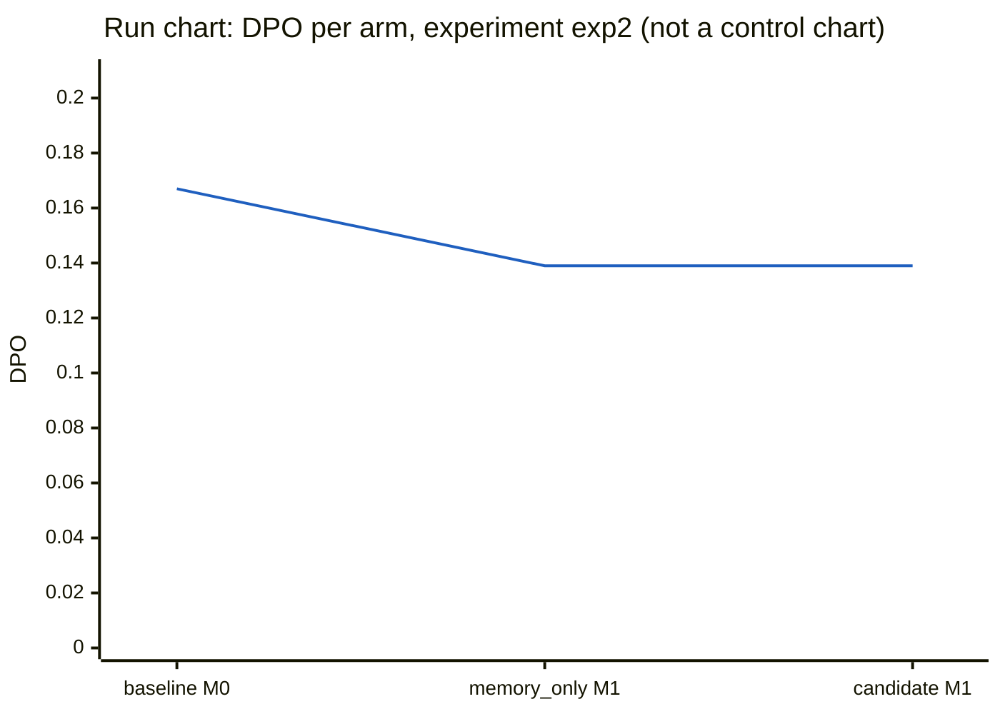

# Experiment exp2: DMAIC report

Generated by `python -m adaptive_harness report` from the MongoDB records of this experiment (runs, events, evaluations, harness_versions, lessons, experiments). Nothing here is written by hand.

- Decision: **rejected** (candidate v3)
- Where the cycle stopped: improve (tollgate did not pass: acceptance rules do not all hold; the current version stays pinned; R2 improvement: development checks passed: candidate worst 11, current best 11)
- Cases: D1 (development), D2 (development), H1 (held_out), H2 (held_out), P1 (control), P2 (control)
- Arms, in the order they ran: baseline (v1 on M0), memory_only (v1 on M1), candidate (v3 on M1)
- Version v1: status baseline, pinned True, config hash `e2f2dfa286b03eb3b3334d6bfb226f9503a5f8534693430191d982c4a8144538`
- Version v2: status rejected, pinned False, config hash `e4b4130ae396e591b9b259261ae228324ff10cc01a23cb759ea01a612791fa22`
- Version v3: status rejected, pinned False, config hash `c1e75c5cd7ccdfbf77f0d8146a00da84a33d0fc5f8bc51e3b72ddc60ff9d8059`

Run ids by arm:

| arm | case | run id | status |
|---|---|---|---|
| baseline | D1 | D1-20260926T164658-395c7c | hold |
| baseline | D2 | D2-20260926T164658-a1fb27 | completed |
| baseline | H1 | H1-20260926T164658-0e9cde | completed |
| baseline | H2 | H2-20260926T164951-0894a6 | completed |
| baseline | P1 | P1-20260926T165024-9b7a1b | completed |
| baseline | P2 | P2-20260926T165034-9e38b5 | completed |
| memory_only | D1 | D1-20260926T165635-a88d24 | hold |
| memory_only | D2 | D2-20260926T165635-0a9c47 | completed |
| memory_only | H1 | H1-20260926T165635-13acb1 | completed |
| memory_only | H2 | H2-20260926T165859-b211ab | completed |
| memory_only | P1 | P1-20260926T165930-6668ca | completed |
| memory_only | P2 | P2-20260926T170006-8aaa50 | completed |
| candidate | D1 | D1-20260926T170245-28a894 | hold |
| candidate | D2 | D2-20260926T170245-861113 | completed |
| candidate | H1 | H1-20260926T170245-f1ac61 | hold |
| candidate | H2 | H2-20260926T170545-fcc6c2 | hold |
| candidate | P1 | P1-20260926T170547-e2b340 | hold |
| candidate | P2 | P2-20260926T170653-9d3051 | hold |

## Define

**Tollgate: PASSED** (passed). 1 development defect(s) in the baseline arm.

### Case set

exp2 is the second improvement cycle. It was run after the DMAIC proposal-history change was merged (commits 1c51f2e and a8ab3a9, merged into main as e655d23), so the improve phase showed the improvement agent the earlier proposal v2, rejected in exp1 on R2 (enabling /checks/venue_match), with its development-case outcome, and the validator refuses an exact repeat of a rejected change set. The baseline is fresh, under the pinned v1 on memory snapshot M0. The case set is the same six cases as exp1: the three default cases (D1, H1, P1) and the three optional race-audit cases (D2, H2, P2), all published in data/cases.json before any harness code. The optional cases are included because the only default development case, D1, has zero races at its venue and so cannot exhibit citation defects; they were fixed in advance and were used, not added. Every pilot arm covers the same six cases.

### Charter

- Evidence: development cases only (D1, D2).
- Baseline (baseline arm, 2 runs): 0.083 (1/12) defects per opportunity; failure categories {"evidence_missing": 1}.

Critical-to-quality characteristics with defects:

| check | name | statement | failure category | DPO (defects/opps) |
|---|---|---|---|---|
| E7 | evidence | Every race row cites recorded tool results from the same run about that race. | evidence_missing | 0.500 (1/2) |

Scope (the editable surfaces):

| cause | surface | description |
|---|---|---|
| method | `/stages` | Stage order and optional stages. |
| material | `/context_policy` | The information each role receives. |
| measurement | `/checks` | In-harness checks. |

Out of scope: model, tools, charters, data, evaluator, specification.

Goal (the acceptance rules):

- No run ends HARNESS after one rerun, judged from run metadata.
- Every check that passes on a control case under the current configuration also passes under the candidate.
- The candidate passes strictly more development-case checks; with repeated runs, its worst run must beat the current configuration's best.
- The candidate passes at least as many held-out checks.
- The candidate's total wall-clock time is at most 1.5 times the current configuration's.

### Problem statement

> On the development cases the baseline arm recorded 1 defect in 12 opportunities across 2 runs (DPO 0.0833), and that defect is in the evidence_missing category. All of it falls on check E7 (evidence: every race row cites recorded tool results from the same run about that race), which failed in 1 of its 2 opportunities (DPO 0.5). No other check recorded a defect in these runs.

## Measure

**Tollgate: PASSED** (passed). measurement valid: 6 baseline run(s) re-scored identically, hashes confirmed, no HARNESS result remains.

### Measurement checks

- Evaluator SHA-256: `44d57885373b57f710a7ef757d47398b3163fd71b4d1926ab4d70ce420044787`
- Answer-key SHA-256: `b010ed344f150fe9f107745a416d91673df9242d72a126aa22f10fc903d8034d` (matches `data/key.sha256`)
- HARNESS reruns: 0

Re-score of every baseline run in a fresh evaluator process:

| run id | identical verdicts | evaluator hash match | key hash match | differing checks |
|---|---|---|---|---|
| D1-20260926T164658-395c7c | True | True | True | none |
| D2-20260926T164658-a1fb27 | True | True | True | none |
| H1-20260926T164658-0e9cde | True | True | True | none |
| H2-20260926T164951-0894a6 | True | True | True | none |
| P1-20260926T165024-9b7a1b | True | True | True | none |
| P2-20260926T165034-9e38b5 | True | True | True | none |

### Defects per opportunity by arm

Each cell is DPO with (defects/opportunities). HARNESS and NA are neither.

| arm | runs | DPO |
|---|---|---|
| baseline (v1 on M0) | 6 | 0.167 (6/36) |
| memory_only (v1 on M1) | 6 | 0.139 (5/36) |
| candidate (v3 on M1) | 6 | 0.139 (5/36) |

### By check

| check | name | baseline | memory_only | candidate |
|---|---|---|---|---|
| E1 | schema | 0.000 (0/6) | 0.000 (0/6) | 0.000 (0/6) |
| E2 | venue | 0.333 (1/3) | 0.000 (0/3) | 0.000 (0/3) |
| E3 | coverage | 0.000 (0/3) | 0.000 (0/3) | 0.000 (0/3) |
| E4 | indicators | 0.000 (0/6) | 0.000 (0/6) | 0.000 (0/6) |
| E5 | arithmetic | 0.000 (0/3) | 0.000 (0/3) | 0.000 (0/3) |
| E6 | disposition | 0.000 (0/3) | 0.000 (0/3) | 0.000 (0/3) |
| E7 | evidence | 0.833 (5/6) | 0.833 (5/6) | 0.833 (5/6) |
| E8 | budget | 0.000 (0/6) | 0.000 (0/6) | 0.000 (0/6) |

### By case set

| case set | baseline | memory_only | candidate |
|---|---|---|---|
| development | 0.083 (1/12) | 0.083 (1/12) | 0.083 (1/12) |
| held_out | 0.167 (2/12) | 0.167 (2/12) | 0.167 (2/12) |
| control | 0.250 (3/12) | 0.167 (2/12) | 0.167 (2/12) |

### Pareto table of defects by check

baseline (v1 on M0):

| check | name | defects | share | cumulative share |
|---|---|---|---|---|
| E7 | evidence | 5 | 0.83 | 0.83 |
| E2 | venue | 1 | 0.17 | 1.00 |

memory_only (v1 on M1):

| check | name | defects | share | cumulative share |
|---|---|---|---|---|
| E7 | evidence | 5 | 1.00 | 1.00 |

candidate (v3 on M1):

| check | name | defects | share | cumulative share |
|---|---|---|---|---|
| E7 | evidence | 5 | 1.00 | 1.00 |

### Cost per baseline run

Token counts come from the provider's usage reports. `input` includes prompt-cache writes (the runner's model client counts cache writes as input, see `adaptive_harness/runner/models.py`); `cache read` is input served from the prompt cache and is not included in `input`.

| run id | case | model calls | tool calls | input | output | cache read | wall s |
|---|---|---|---|---|---|---|---|
| D1-20260926T164658-395c7c | D1 | 20 | 10 | 57,593 | 18,368 | 131,587 | 173.3 |
| D2-20260926T164658-a1fb27 | D2 | 13 | 4 | 43,443 | 22,411 | 29,711 | 216.0 |
| H1-20260926T164658-0e9cde | H1 | 21 | 12 | 63,005 | 18,813 | 158,302 | 205.7 |
| H2-20260926T164951-0894a6 | H2 | 13 | 3 | 41,795 | 14,493 | 45,257 | 123.3 |
| P1-20260926T165024-9b7a1b | P1 | 29 | 18 | 63,301 | 19,278 | 339,037 | 208.8 |
| P2-20260926T165034-9e38b5 | P2 | 14 | 5 | 38,220 | 15,311 | 34,134 | 140.5 |
| mean | | 18.3 | 8.7 | 51,226 | 18,112 | 123,005 | 177.9 |

No sigma level or capability index is reported (see Limits).

## Analyze

**Tollgate: PASSED** (passed). 1 verified controllable root cause(s) of 1 defect(s).

Development defects analyzed: 1; verified: 1; verified and controllable: 1; provisional (never retrieved): 0. Lessons written to snapshot M1.

### Root cause `lesson:exp2:D2-20260926T164658-a1fb27:E7`

- Defect: E7 (evidence_missing) on case D2, run `D2-20260926T164658-a1fb27`
- Cause category: **measurement** (controllable: True); status verified

Why-chain:

1. E7 failed with evidence_missing because the S6 final brief (00029) did not tie its race row to recorded tool results about that race from this run.
2. The visible part of the brief carries only one flat top-level evidence list (00014, 00017, 00020, 00025). No per-row citation is visible, and 00025 is an interval computation (k=0, n=116 messages), not a tool result about the race itself.
3. The brief went out in that state because the only in-harness check at S7 (00030) was a schema check. It passed with no reasons.
4. No check tested whether each race row cites same-run tool results about that race. So S7 recorded disposition GO (00031) and the defect reached the evaluator.

Origin event `D2-20260926T164658-a1fb27:00030` (S7 code check):

```
{"check": "schema", "passed": true, "reasons": []}
```

Source events: `D2-20260926T164658-a1fb27:00029`, `D2-20260926T164658-a1fb27:00025`, `D2-20260926T164658-a1fb27:00030`, `D2-20260926T164658-a1fb27:00031`

Lesson: Before GO, the in-harness checks should confirm that every race row in the final output cites at least one same-run tool_result event about that specific race, such as race_control_messages or track_status for that year and round. Evidence that is only listed at top level, or that comes from derived computations like interval, should count as missing citation.

## Improve

**Tollgate: DID NOT PASS** (stopped). acceptance rules do not all hold; the current version stays pinned; R2 improvement: development checks passed: candidate worst 11, current best 11.

### Proposal history shown to the improvement agent

| version | status | changes | decision reasons |
|---|---|---|---|
| v2 | rejected | replace `/checks/venue_match/enabled` = true | R2 improvement: development checks passed: candidate worst 11, current best 11 |

The agent sees each earlier change set with its development-case outcome only; the validator refuses an exact repeat of a rejected change set.

### Proposal

Candidate v3 from v1, lesson retrieval: vector.

| op | path | value | cites root cause | why |
|---|---|---|---|---|
| replace | `/checks/source_agreement/enabled` | true | `lesson:exp2:D2-20260926T164658-a1fb27:E7` | Both verified root causes say the same thing. The only in-harness check at S7 was schema (00030 in exp2, 00038 in exp1). It passed with no reasons, and the run reached GO (00031, 00039) with nothing testing the race row against same-run tool results. The source_agreement check is the untried measurement option that works on race-level tool results from race_control_messages and track_status. The D2 briefs in both runs carried an unresolved cross-source safety car objection (00029, 00037). Enabling it adds a gate at S7 beyond schema, which can stop a GO when the race row's source evidence is in question. tolerance_laps stays at its current value of 1. |

- Rationale: Both root causes are in the measurement category, so only /checks may change. The lessons ask for a check that each race row cites a same-run tool_result about that race, with interval results excluded. No editable check does exactly that; schema is not editable. venue_match was already tried alone in v2 and gave no improvement (worst 11 vs best 11). min_races_for_rate governs rate eligibility, not citations. source_agreement is the remaining check that deals with the race-specific tool results the E7 evidence requirement refers to. Both failing D2 runs recorded an open objection that the two sources disagree on the safety car. This change is a partial fit at best: the evidence does not show that source_agreement inspects per-row citations. It only shows that the defect escaped because schema was the sole gate.
- Expected effect: E7 on D2 might improve if the check triggers a repair that makes the brief tie its race row to race_control_messages and track_status results for 2025 round 13. Other checks should stay unchanged. The evidence does not guarantee an E7 gain.
- Risks: (1) D2 already shows a safety car disagreement between race control and track status. The check may fail and push D2 to HOLD, or trigger repairs that change other checks. The control-case non-regression rule and the rule requiring strictly more development-case checks would catch this. (2) Extra repair loops could raise wall-clock time or model and tool calls toward the budgets. The 1.5x wall-time rule and the no-HARNESS-after-one-rerun rule would catch this. (3) The check may not touch citations at all, leaving E7 unchanged. The strictly-more development-checks rule would reject the candidate. (4) Held-out cases with legitimate small timing offsets could be held. The held-out rule (at least as many checks passed) would catch this.

**Validator verdict:** valid (no problems).

### Checks by case and arm

One row per case and check; one column per arm. NA rows (check not applicable in every arm) are omitted.

| case | set | check | baseline (v1 on M0) | memory_only (v1 on M1) | candidate (v3 on M1) |
|---|---|---|---|---|---|
| D1 | development | E1 schema | PASS | PASS | PASS |
| D1 | development | E2 venue | PASS | PASS | PASS |
| D1 | development | E3 coverage | PASS | PASS | PASS |
| D1 | development | E4 indicators | PASS | PASS | PASS |
| D1 | development | E5 arithmetic | PASS | PASS | PASS |
| D1 | development | E6 disposition | PASS | PASS | PASS |
| D1 | development | E7 evidence | PASS | PASS | PASS |
| D1 | development | E8 budget | PASS | PASS | PASS |
| D2 | development | E1 schema | PASS | PASS | PASS |
| D2 | development | E4 indicators | PASS | PASS | PASS |
| D2 | development | E7 evidence | FAIL | FAIL | FAIL |
| D2 | development | E8 budget | PASS | PASS | PASS |
| H1 | held_out | E1 schema | PASS | PASS | PASS |
| H1 | held_out | E2 venue | PASS | PASS | PASS |
| H1 | held_out | E3 coverage | PASS | PASS | PASS |
| H1 | held_out | E4 indicators | PASS | PASS | PASS |
| H1 | held_out | E5 arithmetic | PASS | PASS | PASS |
| H1 | held_out | E6 disposition | PASS | PASS | PASS |
| H1 | held_out | E7 evidence | FAIL | FAIL | FAIL |
| H1 | held_out | E8 budget | PASS | PASS | PASS |
| H2 | held_out | E1 schema | PASS | PASS | PASS |
| H2 | held_out | E4 indicators | PASS | PASS | PASS |
| H2 | held_out | E7 evidence | FAIL | FAIL | FAIL |
| H2 | held_out | E8 budget | PASS | PASS | PASS |
| P1 | control | E1 schema | PASS | PASS | PASS |
| P1 | control | E2 venue ◆ | FAIL | PASS | PASS |
| P1 | control | E3 coverage | PASS | PASS | PASS |
| P1 | control | E4 indicators | PASS | PASS | PASS |
| P1 | control | E5 arithmetic | PASS | PASS | PASS |
| P1 | control | E6 disposition | PASS | PASS | PASS |
| P1 | control | E7 evidence | FAIL | FAIL | FAIL |
| P1 | control | E8 budget | PASS | PASS | PASS |
| P2 | control | E1 schema | PASS | PASS | PASS |
| P2 | control | E4 indicators | PASS | PASS | PASS |
| P2 | control | E7 evidence | FAIL | FAIL | FAIL |
| P2 | control | E8 budget | PASS | PASS | PASS |

◆ marks a check whose verdict differs between arms.

Checks passed per case set:

| case set | baseline | memory_only | candidate |
|---|---|---|---|
| development | 11 | 11 | 11 |
| held_out | 10 | 10 | 10 |
| control | 9 | 10 | 10 |

### Acceptance rules

| rule | holds | detail |
|---|---|---|
| R0 | yes | every run valid after at most one rerun |
| R1 | yes | no regression on 2 control case(s) |
| R2 | **no** | development checks passed: candidate worst 11, current best 11 |
| R3 | yes | held-out checks passed: candidate 10, current 10 |
| R4 | yes | wall-clock seconds: candidate 1066.3, current 986.0, limit 1.5x |

Decision: **rejected**.

### Cost per arm

Token counts come from the provider's usage reports. `input` includes prompt-cache writes (the runner's model client counts cache writes as input, see `adaptive_harness/runner/models.py`); `cache read` is input served from the prompt cache and is not included in `input`.

No per-token prices were supplied by the operator, so no dollar cost is reported; tokens are reported per model.

| arm | runs | model calls | tool calls | input | output | cache read | wall s |
|---|---|---|---|---|---|---|---|
| baseline (v1 on M0) | 6 | 110 | 52 | 307,357 | 108,674 | 738,028 | 1,067.6 |
| memory_only (v1 on M1) | 6 | 103 | 46 | 308,310 | 104,596 | 610,067 | 986.0 |
| candidate (v3 on M1) | 6 | 114 | 55 | 356,075 | 110,891 | 947,198 | 1,066.3 |

Split by the model that answered (from the model_call events):

| arm | model | model calls | input | output | cache read |
|---|---|---|---|---|---|
| baseline | claude-opus-5-5 | 18 | 100,683 | 23,801 | 11,785 |
| baseline | claude-sonnet-5 | 92 | 206,674 | 84,873 | 726,243 |
| memory_only | claude-opus-5-5 | 18 | 106,913 | 24,834 | 11,785 |
| memory_only | claude-sonnet-5 | 85 | 201,397 | 79,762 | 598,282 |
| candidate | claude-opus-5-5 | 18 | 107,237 | 24,212 | 17,658 |
| candidate | claude-sonnet-5 | 96 | 248,838 | 86,679 | 929,540 |

Improvement-agent calls (outside the arms):

| phase | model | input | output | cache read |
|---|---|---|---|---|
| define | claude-opus-5-5 | 940 | 226 | 0 |
| analyze | claude-opus-5-5 | 13,378 | 1,052 | 0 |
| improve | claude-opus-5-5 | 7,681 | 1,354 | 0 |

## Control

**Tollgate: not reached.** The cycle stopped before this phase.

- Pinned version: **v1**, config hash `e2f2dfa286b03eb3b3334d6bfb226f9503a5f8534693430191d982c4a8144538`.
- Thresholds: none set. The control phase was not reached, so no control plan was armed for a new version; the pinned version above is unchanged.
- Reaction plan (as specified, applies once a version is accepted and pinned): a later run that passes fewer checks than its case's threshold is a signal; rerun the case 1 time(s); if the signal repeats, pin the parent version and open a new cycle using development-case evidence only. Runs under a different model assignment or FastF1 version are flagged, not compared.
- Confirmation: not run.

### Run chart: DPO per arm

This is a **run chart**, in the order the arms ran, not a control chart: statistical control limits need about 20 runs.

| order | arm | started | defects | opportunities | DPO |
|---|---|---|---|---|---|
| 1 | baseline (v1 on M0) | 2026-09-26 16:46:58 | 6 | 36 | 0.167 |
| 2 | memory_only (v1 on M1) | 2026-09-26 16:56:35 | 5 | 36 | 0.139 |
| 3 | candidate (v3 on M1) | 2026-09-26 17:02:45 | 5 | 36 | 0.139 |



## Limits

- 6 cases (2 development, 2 held_out, 2 control), one run per case per arm (runs recorded per arm: baseline 6, memory_only 6, candidate 6).
- No statistical claim is made: differences between arms are counts from single runs, and the model is not deterministic, so a repeat could differ.
- No sigma level and no capability index are reported; they need far more opportunities than this experiment has.
- The run chart is not a control chart; statistical control limits need about 20 runs.
- Evidence rule (configs/cycle.json): only development cases may inform define, analyze, and the improvement agent's prompts; held-out and control results are used only by code, to verify and control. The define charter above records which cases it drew on.
