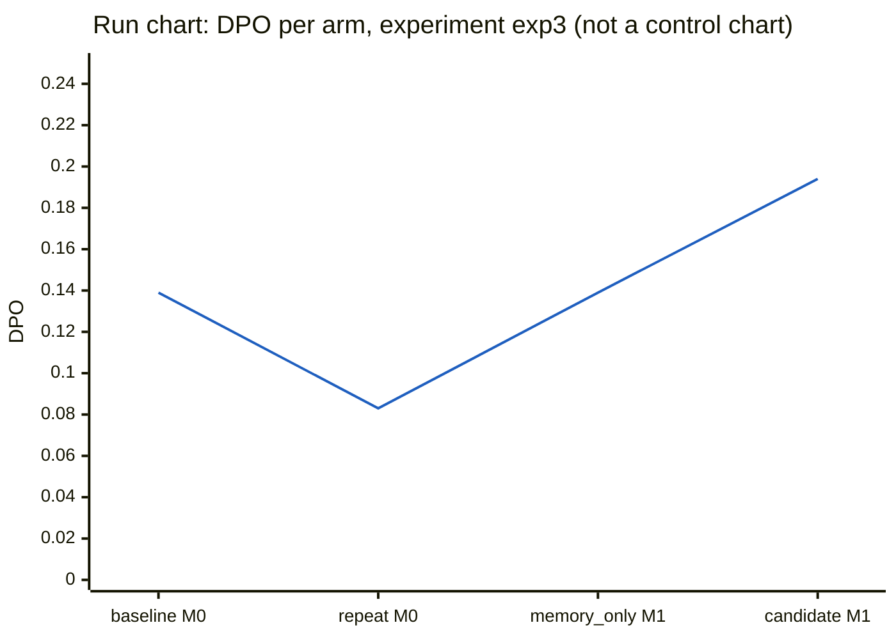

# Experiment exp3: DMAIC report

Generated by `python -m adaptive_harness report` from the MongoDB records of this experiment (runs, events, evaluations, harness_versions, lessons, experiments). Nothing here is written by hand.

- Decision: **rejected** (candidate v4)
- Where the cycle stopped: improve (tollgate did not pass: acceptance rules do not all hold; the current version stays pinned; R1 no regression: case P1: E2, E3 passed under the current version but not the candidate; R2 improvement: development checks passed: candidate worst 11, current best 11)
- Cases: D1 (development), D2 (development), H1 (held_out), H2 (held_out), P1 (control), P2 (control)
- Arms, in the order they ran: baseline (v1 on M0), repeat (v1 on M0), memory_only (v1 on M1), candidate (v4 on M1)
- Version v1: status baseline, pinned True, config hash `e2f2dfa286b03eb3b3334d6bfb226f9503a5f8534693430191d982c4a8144538`
- Version v2: status rejected, pinned False, config hash `e4b4130ae396e591b9b259261ae228324ff10cc01a23cb759ea01a612791fa22`
- Version v3: status rejected, pinned False, config hash `c1e75c5cd7ccdfbf77f0d8146a00da84a33d0fc5f8bc51e3b72ddc60ff9d8059`
- Version v4: status rejected, pinned False, config hash `b0b63f2a66a2b86a7253f67b77a82e2bdebbc612ba65f63723a3034432469a5e`

Run ids by arm:

| arm | case | run id | status |
|---|---|---|---|
| baseline | D1 | D1-20260926T173124-f1ad5d | hold |
| baseline | D2 | D2-20260926T173124-912dd0 | completed |
| baseline | H1 | H1-20260926T173124-e84429 | completed |
| baseline | H2 | H2-20260926T173430-07e50a | completed |
| baseline | P1 | P1-20260926T173957-16004b | completed |
| baseline | P2 | P2-20260926T173957-312c7f | completed |
| repeat | D1 | D1-20260926T174509-3f5324 | hold |
| repeat | D2 | D2-20260926T174509-afe8a2 | completed |
| memory_only | D1 | D1-20260926T175223-f5fd84 | hold |
| memory_only | D2 | D2-20260926T175223-893284 | completed |
| memory_only | H1 | H1-20260926T175223-d3d978 | completed |
| memory_only | H2 | H2-20260926T175515-d194e2 | completed |
| memory_only | P1 | P1-20260926T175529-344cdc | completed |
| memory_only | P2 | P2-20260926T175609-3eb732 | completed |
| candidate | D1 | D1-20260926T175842-145027 | hold |
| candidate | D2 | D2-20260926T175842-ce993b | completed |
| candidate | H1 | H1-20260926T175842-74cebc | completed |
| candidate | H2 | H2-20260926T180138-f87dfe | completed |
| candidate | P1 | P1-20260926T180220-436abd | completed |
| candidate | P2 | P2-20260926T180341-6e33f5 | completed |

## Define

**Tollgate: PASSED** (passed). 1 development defect(s) in the baseline arm.

### Case set

exp3 is the third improvement cycle. Before it, the operator added row_evidence to the in-harness check catalog, off by default, because two earlier cycles (exp1 and exp2) produced the same verified lesson asking for a check that each race row cites same-run tool results about that race, and no catalog check did that job. The operator also added one repair round when any enabled catalog check fails at S7. The operator did not enable the check: whether to enable it was left to the improve phase. The evaluator was unchanged. The improve phase was shown the earlier proposals v2 (enable venue_match, rejected in exp1 on R2) and v3 (enable source_agreement, rejected in exp2 on R2); no validator-refused proposals existed. The baseline is fresh, under the pinned v1 on memory snapshot M0, over the same six cases as exp1 and exp2: the three default cases (D1, H1, P1) and the three optional race-audit cases (D2, H2, P2), all published in data/cases.json before any harness code. The optional cases are included because the only default development case, D1, has zero races at its venue and so cannot exhibit citation defects; they were fixed in advance and were used, not added. Every pilot arm covers the same six cases. Two baseline runs (P1, P2) ended HARNESS when the model provider refused requests for insufficient account credit; after credit was added each was rerun once, and the reruns are the runs scored (see Measure).

### Charter

- Evidence: development cases only (D1, D2).
- Baseline (baseline arm, 2 runs): 0.083 (1/12) defects per opportunity; failure categories {"evidence_missing": 1}.

Critical-to-quality characteristics with defects:

| check | name | statement | failure category | DPO (defects/opps) |
|---|---|---|---|---|
| E7 | evidence | Every race row cites recorded tool results from the same run about that race. | evidence_missing | 0.500 (1/2) |

Scope (the editable surfaces):

| cause | surface | description |
|---|---|---|
| method | `/stages` | Stage order and optional stages. |
| material | `/context_policy` | The information each role receives. |
| measurement | `/checks` | In-harness checks. |

Out of scope: model, tools, charters, data, evaluator, specification.

Goal (the acceptance rules):

- No run ends HARNESS after one rerun, judged from run metadata.
- Every check that passes on a control case under the current configuration also passes under the candidate.
- The candidate passes strictly more development-case checks; with repeated runs, its worst run must beat the current configuration's best.
- The candidate passes at least as many held-out checks.
- The candidate's total wall-clock time is at most 1.5 times the current configuration's.

### Problem statement

> Across 2 baseline runs on the development cases, 1 defect was recorded in 12 opportunities (DPO 0.0833). The only defect was on check E7 (evidence, category evidence_missing): 1 of 2 opportunities failed (DPO 0.5), meaning at least one race row did not cite recorded tool results from the same run about that race. No defects were recorded on any other check.

## Measure

**Tollgate: PASSED** (passed). measurement valid: 8 baseline run(s) re-scored identically, hashes confirmed, no HARNESS result remains.

### Measurement checks

- Evaluator SHA-256: `44d57885373b57f710a7ef757d47398b3163fd71b4d1926ab4d70ce420044787`
- Answer-key SHA-256: `b010ed344f150fe9f107745a416d91673df9242d72a126aa22f10fc903d8034d` (matches `data/key.sha256`)
- HARNESS reruns made by the measure phase: 0

Re-score of every baseline run in a fresh evaluator process:

| run id | identical verdicts | evaluator hash match | key hash match | differing checks |
|---|---|---|---|---|
| D1-20260926T173124-f1ad5d | True | True | True | none |
| D2-20260926T173124-912dd0 | True | True | True | none |
| H1-20260926T173124-e84429 | True | True | True | none |
| H2-20260926T173430-07e50a | True | True | True | none |
| P1-20260926T173444-e7575a | True | True | True | none |
| P2-20260926T173556-8328c9 | True | True | True | none |
| P1-20260926T173957-16004b | True | True | True | none |
| P2-20260926T173957-312c7f | True | True | True | none |

### Repeat of the development cases

The development cases ran once more under v1 on M0 (arm repeat) and were compared check by check with the baseline: 2 case(s) compared; checks that changed between the identical runs: none.

| check | E1 | E2 | E3 | E4 | E5 | E6 | E7 | E8 |
|---|---|---|---|---|---|---|---|---|
| changes | 0 | 0 | 0 | 0 | 0 | 0 | 0 | 0 |

### HARNESS results

Measurement-system failures: neither defects nor opportunities. Each case was rerun once and the rerun is the run scored.

| arm | case | run id | cause (recorded error) | rerun scored |
|---|---|---|---|---|
| baseline | P1 | P1-20260926T173444-e7575a | APIStatusError: {'type': 'error', 'error': {'details': None, 'type': 'invalid_request_error', 'message': 'Your credit balance is too low to access the Anthropic API. Please go to Plans & Billing to upgrade or purchase... | P1-20260926T173957-16004b |
| baseline | P2 | P2-20260926T173556-8328c9 | APIStatusError: {'type': 'error', 'error': {'details': None, 'type': 'invalid_request_error', 'message': 'Your credit balance is too low to access the Anthropic API. Please go to Plans & Billing to upgrade or purchase... | P2-20260926T173957-312c7f |

### Defects per opportunity by arm

Each cell is DPO with (defects/opportunities). HARNESS and NA are neither.

| arm | runs | DPO |
|---|---|---|
| baseline (v1 on M0) | 6 | 0.139 (5/36) |
| repeat (v1 on M0) | 2 | 0.083 (1/12) |
| memory_only (v1 on M1) | 6 | 0.139 (5/36) |
| candidate (v4 on M1) | 6 | 0.194 (7/36) |

### By check

| check | name | baseline | repeat | memory_only | candidate |
|---|---|---|---|---|---|
| E1 | schema | 0.000 (0/6) | 0.000 (0/2) | 0.000 (0/6) | 0.000 (0/6) |
| E2 | venue | 0.000 (0/3) | 0.000 (0/1) | 0.000 (0/3) | 0.333 (1/3) |
| E3 | coverage | 0.000 (0/3) | 0.000 (0/1) | 0.000 (0/3) | 0.333 (1/3) |
| E4 | indicators | 0.000 (0/6) | 0.000 (0/2) | 0.000 (0/6) | 0.000 (0/6) |
| E5 | arithmetic | 0.000 (0/3) | 0.000 (0/1) | 0.000 (0/3) | 0.000 (0/3) |
| E6 | disposition | 0.000 (0/3) | 0.000 (0/1) | 0.000 (0/3) | 0.000 (0/3) |
| E7 | evidence | 0.833 (5/6) | 0.500 (1/2) | 0.833 (5/6) | 0.833 (5/6) |
| E8 | budget | 0.000 (0/6) | 0.000 (0/2) | 0.000 (0/6) | 0.000 (0/6) |

### By case set

| case set | baseline | repeat | memory_only | candidate |
|---|---|---|---|---|
| development | 0.083 (1/12) | 0.083 (1/12) | 0.083 (1/12) | 0.083 (1/12) |
| held_out | 0.167 (2/12) | n/a (0/0) | 0.167 (2/12) | 0.167 (2/12) |
| control | 0.167 (2/12) | n/a (0/0) | 0.167 (2/12) | 0.333 (4/12) |

### Pareto table of defects by check

baseline (v1 on M0):

| check | name | defects | share | cumulative share |
|---|---|---|---|---|
| E7 | evidence | 5 | 1.00 | 1.00 |

repeat (v1 on M0):

| check | name | defects | share | cumulative share |
|---|---|---|---|---|
| E7 | evidence | 1 | 1.00 | 1.00 |

memory_only (v1 on M1):

| check | name | defects | share | cumulative share |
|---|---|---|---|---|
| E7 | evidence | 5 | 1.00 | 1.00 |

candidate (v4 on M1):

| check | name | defects | share | cumulative share |
|---|---|---|---|---|
| E7 | evidence | 5 | 0.71 | 0.71 |
| E2 | venue | 1 | 0.14 | 0.86 |
| E3 | coverage | 1 | 0.14 | 1.00 |

### Cost per baseline run

Token counts come from the provider's usage reports. `input` includes prompt-cache writes (the runner's model client counts cache writes as input, see `adaptive_harness/runner/models.py`); `cache read` is input served from the prompt cache and is not included in `input`.

| run id | case | model calls | tool calls | input | output | cache read | wall s |
|---|---|---|---|---|---|---|---|
| D1-20260926T173124-f1ad5d | D1 | 31 | 21 | 90,728 | 27,410 | 456,055 | 272.7 |
| D2-20260926T173124-912dd0 | D2 | 13 | 4 | 48,523 | 20,205 | 28,186 | 199.9 |
| H1-20260926T173124-e84429 | H1 | 22 | 12 | 69,501 | 18,292 | 168,038 | 185.8 |
| H2-20260926T173430-07e50a | H2 | 13 | 4 | 46,274 | 15,089 | 35,884 | 138.2 |
| P1-20260926T173957-16004b | P1 | 27 | 17 | 55,893 | 19,247 | 290,769 | 198.5 |
| P2-20260926T173957-312c7f | P2 | 14 | 5 | 45,874 | 16,471 | 35,550 | 152.8 |
| mean | | 20.0 | 10.5 | 59,466 | 19,452 | 169,080 | 191.3 |

No sigma level or capability index is reported (see Limits).

## Analyze

**Tollgate: PASSED** (passed). 1 verified controllable root cause(s) of 1 defect(s).

Development defects analyzed: 1; verified: 1; verified and controllable: 1; provisional (never retrieved): 0. Lessons written to snapshot M1.

### Root cause `lesson:exp3:D2-20260926T173124-912dd0:E7`

- Defect: E7 (evidence_missing) on case D2, run `D2-20260926T173124-912dd0`
- Cause category: **measurement** (controllable: True); status verified

Why-chain:

1. Check E7 failed with evidence_missing on the final race_audit output at event D2-20260926T173124-912dd0:00029: the evaluator did not find, for every race row, citations to recorded tool results from this run about that race.
2. The run still reached disposition GO with no reasons at event D2-20260926T173124-912dd0:00031. Nothing inside the harness stopped an output whose per-row evidence was incomplete.
3. The only in-harness check before the decision was the S7 check at event D2-20260926T173124-912dd0:00030, and it was a schema check. It passed with an empty reasons list.
4. The recorded checks include no test that each race row, and each SC, VSC and red-flag answer, cites same-run tool_result events about that race. Examples of such events are D2-20260926T173124-912dd0:00017 and D2-20260926T173124-912dd0:00020. A row could also cite a tool result that is not about the race, such as the interval result D2-20260926T173124-912dd0:00025. The gap therefore reached the evaluator undetected.

Origin event `D2-20260926T173124-912dd0:00030` (S7 code check):

```
{"check": "schema", "passed": true, "reasons": []}
```

Source events: `D2-20260926T173124-912dd0:00030`, `D2-20260926T173124-912dd0:00031`, `D2-20260926T173124-912dd0:00029`, `D2-20260926T173124-912dd0:00027`, `D2-20260926T173124-912dd0:00017`, `D2-20260926T173124-912dd0:00020`, `D2-20260926T173124-912dd0:00025`

Lesson: Before the S7 decision, run an in-harness evidence check in addition to the schema check. It should verify that every race row and every SC, VSC and red-flag answer cites recorded tool_result event ids from the same run about that race, and it should return HOLD if any citation is missing.

## Improve

**Tollgate: DID NOT PASS** (stopped). acceptance rules do not all hold; the current version stays pinned; R1 no regression: case P1: E2, E3 passed under the current version but not the candidate; R2 improvement: development checks passed: candidate worst 11, current best 11.

### Proposal history shown to the improvement agent

| version | status | changes | decision reasons |
|---|---|---|---|
| v2 | rejected | replace `/checks/venue_match/enabled` = true | R2 improvement: development checks passed: candidate worst 11, current best 11 |
| v3 | rejected | replace `/checks/source_agreement/enabled` = true | R2 improvement: development checks passed: candidate worst 11, current best 11 |

The agent sees each earlier change set with its development-case outcome only; the validator refuses an exact repeat of a rejected change set.

### Proposal

Candidate v4 from v1, lesson retrieval: vector.

| op | path | value | cites root cause | why |
|---|---|---|---|---|
| add | `/checks/row_evidence` | {"enabled": true} | `lesson:exp3:D2-20260926T173124-912dd0:E7` | All three verified root causes for the D2 E7 evidence_missing defect say the same thing. The only in-harness check at S7 was the schema check (events 00030/00038), and it passed with no reasons. The runs then reached GO (00031/00039) even though no race row was tested for citing same-run tool_result events about that race. Enabling row_evidence adds that missing measurement before the S7 decision. |

- Rationale: E7 is the only defect in the baseline: 1 of 2 opportunities, on case D2. Its three verified root causes are all measurement causes on /checks, and they share one mechanism. The final S6 brief carried only a flat top-level evidence list. That list mixed race tool results (race_control_messages and track_status for year 2025, round 13) with interval computations, which are not about the race (for example 00025 and 00027). The schema-only S7 check let the brief through to GO. Two earlier candidates were rejected with worst 11 against best 11 on the development cases. v2 enabled venue_match and v3 enabled source_agreement, and neither addresses per-row citation. The row_evidence check does. It has not been tried before, and it is the check the lessons describe. This change set differs from both rejected versions.
- Expected effect: E7 on development case D2 should stop reaching the evaluator undetected. If the check causes the row citations to be repaired before GO, E7 should pass and development checks passed should rise from 11 to 12 of 12. The evidence does not show whether a failing row_evidence check leads to repair or to HOLD, so the size of the gain on E7 is not certain.
- Risks: 1. If row_evidence fails and the run goes to HOLD rather than being repaired, other checks that depend on disposition or completion could fail. That would show up as regressions on control cases (caught by the control-case rule) or as no net gain (caught by the development rule, which needs the candidate's worst run to beat the current best of 11). 2. Any added repair or rerun work could raise wall-clock time (caught by the 1.5x wall-clock rule) or end runs as HARNESS (caught by the no-HARNESS-after-one-rerun rule). 3. On held-out cases, a strict check could flag rows that previously passed (caught by the held-out rule, which requires at least as many passes).

**Validator verdict:** valid (no problems).

### Checks by case and arm

One row per case and check; one column per arm. NA rows (check not applicable in every arm) are omitted.

| case | set | check | baseline (v1 on M0) | repeat (v1 on M0) | memory_only (v1 on M1) | candidate (v4 on M1) |
|---|---|---|---|---|---|---|
| D1 | development | E1 schema | PASS | PASS | PASS | PASS |
| D1 | development | E2 venue | PASS | PASS | PASS | PASS |
| D1 | development | E3 coverage | PASS | PASS | PASS | PASS |
| D1 | development | E4 indicators | PASS | PASS | PASS | PASS |
| D1 | development | E5 arithmetic | PASS | PASS | PASS | PASS |
| D1 | development | E6 disposition | PASS | PASS | PASS | PASS |
| D1 | development | E7 evidence | PASS | PASS | PASS | PASS |
| D1 | development | E8 budget | PASS | PASS | PASS | PASS |
| D2 | development | E1 schema | PASS | PASS | PASS | PASS |
| D2 | development | E4 indicators | PASS | PASS | PASS | PASS |
| D2 | development | E7 evidence | FAIL | FAIL | FAIL | FAIL |
| D2 | development | E8 budget | PASS | PASS | PASS | PASS |
| H1 | held_out | E1 schema | PASS | - | PASS | PASS |
| H1 | held_out | E2 venue | PASS | - | PASS | PASS |
| H1 | held_out | E3 coverage | PASS | - | PASS | PASS |
| H1 | held_out | E4 indicators | PASS | - | PASS | PASS |
| H1 | held_out | E5 arithmetic | PASS | - | PASS | PASS |
| H1 | held_out | E6 disposition | PASS | - | PASS | PASS |
| H1 | held_out | E7 evidence | FAIL | - | FAIL | FAIL |
| H1 | held_out | E8 budget | PASS | - | PASS | PASS |
| H2 | held_out | E1 schema | PASS | - | PASS | PASS |
| H2 | held_out | E4 indicators | PASS | - | PASS | PASS |
| H2 | held_out | E7 evidence | FAIL | - | FAIL | FAIL |
| H2 | held_out | E8 budget | PASS | - | PASS | PASS |
| P1 | control | E1 schema | PASS | - | PASS | PASS |
| P1 | control | E2 venue ◆ | PASS | - | PASS | FAIL |
| P1 | control | E3 coverage ◆ | PASS | - | PASS | FAIL |
| P1 | control | E4 indicators | PASS | - | PASS | PASS |
| P1 | control | E5 arithmetic | PASS | - | PASS | PASS |
| P1 | control | E6 disposition | PASS | - | PASS | PASS |
| P1 | control | E7 evidence | FAIL | - | FAIL | FAIL |
| P1 | control | E8 budget | PASS | - | PASS | PASS |
| P2 | control | E1 schema | PASS | - | PASS | PASS |
| P2 | control | E4 indicators | PASS | - | PASS | PASS |
| P2 | control | E7 evidence | FAIL | - | FAIL | FAIL |
| P2 | control | E8 budget | PASS | - | PASS | PASS |

◆ marks a check whose verdict differs between arms.

Checks passed per case set:

| case set | baseline | repeat | memory_only | candidate |
|---|---|---|---|---|
| development | 11 | 11 | 11 | 11 |
| held_out | 10 | 0 | 10 | 10 |
| control | 10 | 0 | 10 | 8 |

### Acceptance rules

| rule | holds | detail |
|---|---|---|
| R0 | yes | every run valid after at most one rerun |
| R1 | **no** | case P1: E2, E3 passed under the current version but not the candidate |
| R2 | **no** | development checks passed: candidate worst 11, current best 11 |
| R3 | yes | held-out checks passed: candidate 10, current 10 |
| R4 | yes | wall-clock seconds: candidate 1181.9, current 993.0, limit 1.5x |

Decision: **rejected**.

### Cost per arm

Token counts come from the provider's usage reports. `input` includes prompt-cache writes (the runner's model client counts cache writes as input, see `adaptive_harness/runner/models.py`); `cache read` is input served from the prompt cache and is not included in `input`.

No per-token prices were supplied by the operator, so no dollar cost is reported; tokens are reported per model.

| arm | runs | model calls | tool calls | input | output | cache read | wall s |
|---|---|---|---|---|---|---|---|
| baseline (v1 on M0) | 6 | 120 | 63 | 356,793 | 116,714 | 1,014,482 | 1,147.9 |
| repeat (v1 on M0) | 2 | 46 | 26 | 111,039 | 50,925 | 407,070 | 552.9 |
| memory_only (v1 on M1) | 6 | 109 | 53 | 313,892 | 98,500 | 767,895 | 993.0 |
| candidate (v4 on M1) | 6 | 131 | 67 | 389,323 | 120,160 | 1,490,129 | 1,181.9 |

Split by the model that answered (from the model_call events):

| arm | model | model calls | input | output | cache read |
|---|---|---|---|---|---|
| baseline | claude-opus-5-5 | 18 | 114,022 | 26,402 | 10,860 |
| baseline | claude-sonnet-5 | 102 | 242,771 | 90,312 | 1,003,622 |
| repeat | claude-opus-5-5 | 6 | 40,808 | 9,423 | 2,434 |
| repeat | claude-sonnet-5 | 40 | 70,231 | 41,502 | 404,636 |
| memory_only | claude-opus-5-5 | 18 | 102,199 | 23,501 | 14,204 |
| memory_only | claude-sonnet-5 | 91 | 211,693 | 74,999 | 753,691 |
| candidate | claude-opus-5-5 | 18 | 110,937 | 25,185 | 17,658 |
| candidate | claude-sonnet-5 | 113 | 278,386 | 94,975 | 1,472,471 |

Improvement-agent calls (outside the arms):

| phase | model | input | output | cache read |
|---|---|---|---|---|
| define | claude-opus-5-5 | 940 | 222 | 0 |
| analyze | claude-opus-5-5 | 13,099 | 1,231 | 0 |
| improve | claude-opus-5-5 | 10,469 | 1,088 | 0 |

## Control

**Tollgate: not reached.** The cycle stopped before this phase.

- Pinned version: **v1**, config hash `e2f2dfa286b03eb3b3334d6bfb226f9503a5f8534693430191d982c4a8144538`.
- Thresholds: none set. The control phase was not reached, so no control plan was armed for a new version; the pinned version above is unchanged.
- Reaction plan (as specified, applies once a version is accepted and pinned): a later run that passes fewer checks than its case's threshold is a signal; rerun the case 1 time(s); if the signal repeats, pin the parent version and open a new cycle using development-case evidence only. Runs under a different model assignment or FastF1 version are flagged, not compared.
- Confirmation: not run.

### Run chart: DPO per arm

This is a **run chart**, in the order the arms ran, not a control chart: statistical control limits need about 20 runs.

| order | arm | started | defects | opportunities | DPO |
|---|---|---|---|---|---|
| 1 | baseline (v1 on M0) | 2026-09-26 17:31:24 | 5 | 36 | 0.139 |
| 2 | repeat (v1 on M0) | 2026-09-26 17:45:09 | 1 | 12 | 0.083 |
| 3 | memory_only (v1 on M1) | 2026-09-26 17:52:24 | 5 | 36 | 0.139 |
| 4 | candidate (v4 on M1) | 2026-09-26 17:58:42 | 7 | 36 | 0.194 |



## Limits

- 6 cases (2 development, 2 held_out, 2 control), one run per case per arm (runs recorded per arm: baseline 8, repeat 2, memory_only 6, candidate 6).
- No statistical claim is made: differences between arms are counts from single runs, and the model is not deterministic, so a repeat could differ.
- No sigma level and no capability index are reported; they need far more opportunities than this experiment has.
- The run chart is not a control chart; statistical control limits need about 20 runs.
- Evidence rule (configs/cycle.json): only development cases may inform define, analyze, and the improvement agent's prompts; held-out and control results are used only by code, to verify and control. The define charter above records which cases it drew on.
