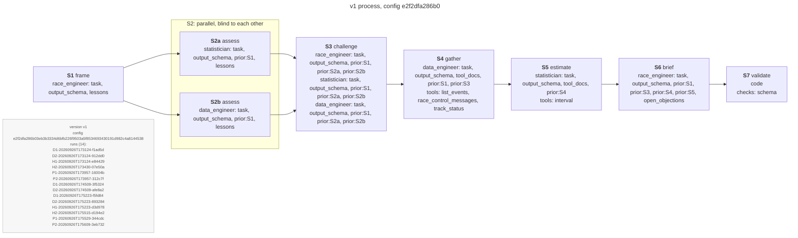
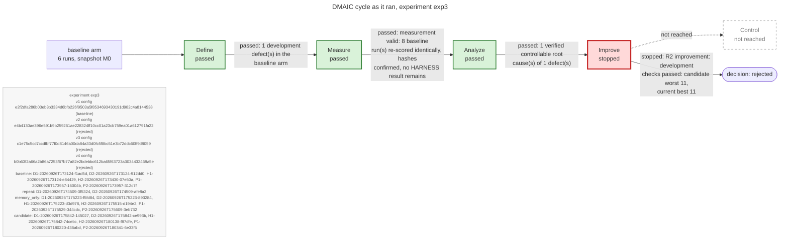
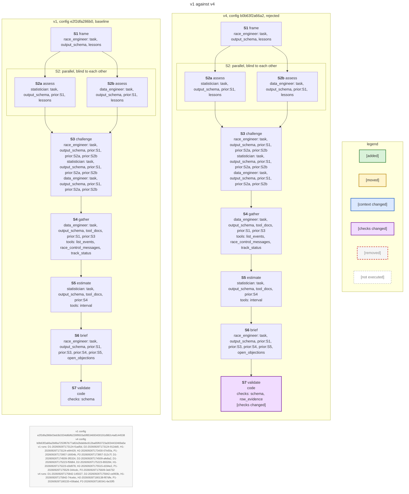

# Maps: experiment exp3

Generated by `python -m adaptive_harness maps` from the stored harness configurations and the experiment's records; not drawn by hand. Stage node ids are stable (`<version>_<stage id>`).

Legend: [added] stage not in the older version; [moved] stage in a different position; [context changed] a role at that stage receives different context items; [checks changed] the in-harness checks run at S7 differ; [removed] stage dropped from the newer version (dashed red); [not executed] stage with no recorded event in that version's runs (dashed grey). Node ids are the stable stage ids (e.g. v1_S4).

- v1: config hash `e2f2dfa286b03eb3b3334d6bfb226f9503a5f8534693430191d982c4a8144538`, status baseline, pinned True
- v4: config hash `b0b63f2a66a2b86a7253f67b77a82e2bdebbc612ba65f63723a3034432469a5e`, status rejected, pinned False

## The v1 process

Each node: stage id and name; for model stages each role with its context items, and the tools; for S7 the enabled in-harness checks.

Exported: [v1_process.svg](maps_exp3/v1_process.svg), [v1_process.png](maps_exp3/v1_process.png)

## The DMAIC cycle of exp3 as it ran

Each edge carries the tollgate verdict of the phase it leaves; phases not reached are dashed.

Exported: [dmaic_cycle.svg](maps_exp3/dmaic_cycle.svg), [dmaic_cycle.png](maps_exp3/dmaic_cycle.png)

## v1 against v4

Changes: S7: [checks changed]; check row_evidence: None -> {'enabled': True}.

Exported: [v1_vs_v4.svg](maps_exp3/v1_vs_v4.svg), [v1_vs_v4.png](maps_exp3/v1_vs_v4.png)
